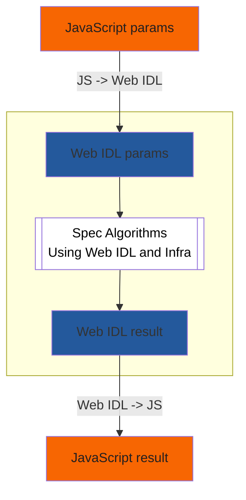

# Introduction to Writing Specifications with Bikeshed

- [Introduction to Writing Specifications with Bikeshed](#introduction-to-writing-specifications-with-bikeshed)
  - [Meta](#meta)
  - [Overview](#overview)
  - [Installing Bikeshed, Running and Publishing](#installing-bikeshed-running-and-publishing)
    - [Create a Specification Source](#create-a-specification-source)
    - [Run Bikeshed Locally](#run-bikeshed-locally)
    - [Publish with GitHub](#publish-with-github)
  - [Specification Languages](#specification-languages)
    - [Bikeshed Markdown to HTML](#bikeshed-markdown-to-html)
    - [JavaScript to Web IDL (with Infra) to JavaScript](#javascript-to-web-idl-with-infra-to-javascript)
  - [A Strategy for incremental development](#a-strategy-for-incremental-development)
    - [Add WebIDL](#add-webidl)
    - [Describe WebIDL](#describe-webidl)
    - [Add Algorithms](#add-algorithms)
    - [Define Attributes](#define-attributes)
    - [Define Methods](#define-methods)
    - [Define Constructors](#define-constructors)
    - [Define Other Terms](#define-other-terms)
  - [Examples of Different Kinds of Specifications](#examples-of-different-kinds-of-specifications)
- [Related Resources](#related-resources)
  - [Initial setup](#initial-setup)
  - [Sample Full Specifications following Best Practices](#sample-full-specifications-following-best-practices)
  - [Other Intros and Resources](#other-intros-and-resources)
    - [Not specific to Bikeshed](#not-specific-to-bikeshed)
- [CSS for domintro](#css-for-domintro)

## Meta

- This document: [Introduction to Writing Specifications with Bikeshed](https://dlaliberte.github.io/bikeshed-intro/index.html)
- Source: [bikeshed-intro/index.md at updates · dlaliberte/bikeshed-intro](http://go/gh/dlaliberte/bikeshed-intro/blob/updates/index.md)
- Issues: [Issues · dlaliberte/bikeshed-intro](http://go/gh/dlaliberte/bikeshed-intro/issues)

## Overview

As the [Bikeshed Documentation](https://tabatkins.github.io/bikeshed/) says: "Bikeshed is a spec-generating tool that takes in lightly-decorated Markdown and spits out a full spec, with cross-spec autolinking, automatic generation of indexes/ToC/etc, and many other features."

This document is intended as a simple introduction to writing specifications of web APIs using Bikeshed.  Very extensive documentation of Bikeshed is available, but it is a complex tool and there is a lot to learn before one can become productive.

So the goal here is to help beginners get started using Bikeshed in the simplest way possible. And then we provide some guidance for starting to write the first few revisions of a specification.  We only cover the basics for many topics and refer to other documents for more complete details.  The following topics are covered here:

- [Installing Bikeshed](#installing-bikeshed)
- [Using GitHub](#using-github) for your specification repository
- [Strategies for incremental development](#strategies-for-incremental-development) of your specification


## Installing Bikeshed, Running and Publishing

The [Bikeshed Documentation: Installation](https://tabatkins.github.io/bikeshed/#installing) provides details on  several different ways for how to install and run Bikeshed.  We recommend you install it on a local machine so you can run it multiple times as you make changes to the specification.

- Make sure you have Python 3.7 or later.
- Install Bikeshed with pip3, if you can.
  - `pip3 install bikeshed`
  - `bikeshed update`
- Alternatively, you can use pip or pipenv, but see details at: [Bikeshed Documentation - Installing Bikeshed Itself](https://tabatkins.github.io/bikeshed/#install-final)
- You don't need to install "Bikeshed for Development", unless you are planning to do development on Bikeshed itself.


### Create a Specification Source

Create an initial "empty" specification file as your source, e.g. `index.bs`.

 You can copy this [Minimal template](http://go/gh/WICG/starter-kit/blob/main/templates/index.bs), or you can run `bikeshed template > index.bs` to generate the following minimal template.

```markdown
<pre class='metadata'>
Title: Your Spec Title
Shortname: your-spec
Level: 1
Status: w3c/UD
Group: WGNAMEORWHATEVER
URL: https://dlaliberte.github.io/bikeshed-examples/template.html
Editor: Your Name, Your Company http://example.com/your-company, your-email@example.com, http://example.com/your-personal-website
Abstract: A short description of your spec, one or two sentences.
</pre>

Introduction {#intro}
=====================

Introduction here.

```

### Run Bikeshed Locally

You can run Bikeshed locally on your spec with `bikeshed spec index.bs` to generate `index.html`.

The `index.bs` template will contain only a `"metadata"` section and an Introduction, but when you run `bikeshed spec index.html`, the `index.html` file will include the following sections (plus  two added sections which are required in all specifications).
(Link to bikeshed-examples/template.html)

- **Title**:
  - Metadata details about this document:
    - **This version**: Tte URL you provide in metadata.
    - **Editor**: The name and links you provide in metadata.
    - **copywright**: Generated for you.

- **Abstract**: From the metadata.

- **Status of this document**: From the metadata.

- **Table of Contents**: Generated automatically from sections.

- **Introduction**: This section provides an overview of the purpose and scope of the standard.

- **Security considerations**: _Add this section_, which describes security issues related to the standard and provides guidance on how to mitigate them.

- **Privacy considerations**: _Add this section_, which describes privacy issues related to the standard and provides guidance on how to address them.

- **Conformance**: This section describes how to conform to the standard and specifies the requirements for conformance.

  - **Document conventions**: Generated content.

  - **Conformant Algorithms**: Generated content.

- **References**:

  - **Normative References**: This section lists the other standards and specifications that are referenced within the document and are required for implementation of the standard.


### Publish with GitHub

Assuming you will be using GitHub to develop and provide public access to your specification, you should first decide whether you will use an existing repo or create a new repo to serve as the "publishing source" repo for your specification. You'll need to be an admin for this source repo.

To easily initialize a new repository with content, first create a new repository without `README`, `.gitignore`, or `license`, and then run `npx wicg init "My Awesome API"`.

Then, it is convenient to set up a "GitHub Pages site" for publishing and serving the html file that will be generated by bikeshed from your source file.


- Follow instructions for [Publishing with a custom GitHub Actions workflow](https://docs.github.com/en/pages/getting-started-with-github-pages/creating-a-github-pages-site).  I.e. go to "Settings" > "Pages" to show "GitHub Pages"
- Under "Build and deployment" > "Source", select "GitHub Actions" if not already selected.
- Click the "create your own" link to start creating a yml script.
  - Enter the name of the file (after `.github/workflows/`) to `build.yml` or `some-other.yml`.
  - Use the following script, changing `index.bs` and `index.html` if need be.
    - For more sample workflow actions, see [Spec Prod Documentation](https://w3c.github.io/spec-prod/)

```yml
name: Build
on:
  pull_request: {}
  push:
    branches:
    - main
jobs:
  build:
    name: Build
    runs-on: ubuntu-latest
    steps:
    - uses: actions/checkout@v3
    - uses: w3c/spec-prod@v2
      with:
        TOOLCHAIN: bikeshed
        SOURCE: index.bs
        DESTINATION: index.html
        GH_PAGES_BRANCH: gh-pages
        BUILD_FAIL_ON: warning
```
- Change permissions to allow `github-actions[bot]` under Settings > Actions > General > Workflow permissions.  The default is "Read repository contents and packages permission", so change that to: "Read and write permissions".  Remember to click "Save".


- Submit updates to your specification source, e.g. `index.bs`, to GitHub, which should then trigger the action that updates `index.html`.
- If your repo is `github.com/owner/repo-name`, then your html file will be at `owner.github.io/repo-name/index.html`.

- Optional Configurations
  - Maybe turn on [GitHub Apps - PR Preview](https://github.com/apps/pr-preview) for any repo that is not of one of the blanket-installed orgs listed there.  If you used the `npx` command above, the configuration file will be installed for you.

## Specification Languages

### Bikeshed Markdown to HTML

Bikeshed uses a Markdown variant called [Bikeshed-flavored Markdown (BSMD)](https://speced.github.io/bikeshed/#markdown).  By default, it recognizes all of the "block-level" Markdown constructs defined by [CommonMark](https://commonmark.org/), except for indented code blocks.  You can freely switch back and forth between Markdown and HTML as needed, and indent properly.

### JavaScript to Web IDL (with Infra) to JavaScript

In a browser, JavaScript calls to browser APIs result in...

WebIDL and Infra are complementary technologies. WebIDL is used to define the interfaces of web APIs, while Infra is used to implement those interfaces.

<table style="border:0">
<tr>
<td style="border:0">



</td>
<td style="border: 0; align:top">
 <b>JS types</b>: <br/>
 boolean, number, array, object, ...
 <br/><br/><br/>
 <b>Web IDL types</b>:<br/>
 boolean, unsigned long, sequence, dictionary, ...
  <br/><br/>
 <b>Infra types</b>: boolean, bytes (for strings), lists, ordered maps
  <br/><br/><br/><br/><br/><br/><br/><br/>
</td>
</tr>
</table>


## A Strategy for incremental development

Once you have created an initial spec document, it might be easiest to follow the following steps to incrementally grow your spec.

1. Start with a Template or similar document
2. Add WebIDL
3. Describe WebIDL
4. Add Algorithms

### Add WebIDL

If you have WebIDL specifications for your API code, that is a great place to start.  Simply copy-paste a subset of the WebIDL that corresponds to the public API into an `<xmp class="idl">` tag.  Bikeshed docs recommend using the `<xmp>` tag rather than the `<pre>` tag so that you will not need to HTML-escape `&` and `<` characters.

You will typically define your algorithm steps relative to an interface declared with WebIDL.  Here is an example of an interface that will be used in the following sections.

```html
<xmp class="idl">
interface Foo {
    attribute DOMString bar;
    constructor(DOMString arg1);
    long baz(DOMString arg1);
};
</xmp>
```

### Describe WebIDL

Immediately before or after each WebIDL block, it is important to include a short, non-normative description, or **`"domintro"`** for each property defined. These descriptive blocks are especially important for algorithmic specifications which are otherwise difficult to read.

Here is the suggested markup for a domintro block.
Below, you can find the CSS for the domintro class.

```html
<dl class="domintro">
  <dt><code>property</code>
  <dd>
    <p>Brief summary of property
</dl>
```


### Add Algorithms

Once you have some WebIDL declarations of functions and types of parameters, then you can define an **algorithm** for each function in terms of Web IDL along with Infra declarations for internal state. Use a `<div class="algorithm">` container for your algorithm steps, so Bikeshed can add nice default styling to make the algorithms easier to read.

```html
<div algorithm="my-algorithm">
  ...your algorithm steps here...
  1. step-1
  1. step-2
  1. step-3
</div>
```

Within attributes, method steps, you implicitly have access to `[=this=]`, the object being operated on.

### Define Attributes

Each WebIDL attribute of an object is actually a getter/setter pair. By default these refer to some internal state of the object, not directly observable by author-facing JS, but may be referenced by other spec algorithms. For example, given:

```html
<xmp class="idl">
interface Foo {
  attribute DOMString bar;
};
</xmp>
```

This implies, by default, that `Foo` instances have a `[[bar]]` internal slot, and the `bar` attribute's getter and setter access and modify that slot, respectively. Note that when referencing the attribute in spec algorithms, you **must** refer to the internal slot, not the author-facing property, as those can be observed/intercepted by author code.  Use text like "...`the {{Foo/bar}} internal slot`...".

If you're doing something non-trivial, you may need to explicitly define a name like: `<dfn for=Foo>\[[bar]]</dfn>` (since Bikeshed doesn't auto-define the `[[bar]]` slot name for you yet).

If your attribute getter or setter need to do something non-trivial, such as reacting to its state ways that the WebIDL type system does not, you'll need to write a getter/setter algorithm yourself. Use the following markup:

```html
<div algorithm="Foo.bar">
  The <dfn attribute for=Foo>bar</dfn> [=getter steps=] are:

  1. Return [=this=]'s {{Foo/[[internalBar]]}} slot.

  The {{Foo/bar}} [=setter steps=] are:

  1. Set [=this=]'s {{Foo/[[internalBar]]}} slot to [=the given value=].
</div>
```

Within getter steps, you implicitly have access to the instance, `[=this=]`. Within setter steps, you have access to `[=this=]` and `[=the given value=]`, which is the value being set (and which has already been checked/transformed by WebIDL into the expected value type).

Readonly attributes won't have setter steps.

### Define Methods

Every method needs an algorithm defining it. Given an interface like:

```html
<xmp class="idl">
interface Foo {
  long baz(DOMString arg1);
};
</xmp>
```

Use markup like:

```html
<div algorithm="Foo.baz()">
  The <dfn method for=Foo>baz(DOMString |arg1|)</dfn> [=method steps=] are:

  1. Do something to |arg1|.
  2. If [=this's=] {{Foo/bar}} attribute is null, [=throw=] a TypeError.
  3. Otherwise, return 4.
</div>
```

By using the variable markup `|arg1|` in the defining signature, you can refer to the arguments within the method steps using the same notation.


### Define Constructors

If you don't define a constructor for a class, one gets created automatically for you that just throws. If you actually want your object to be constructable, it's very similar to methods. Given IDL like:

```html
<xmp class="idl">
interface Foo {
  constructor(DOMString arg1);
};
</xmp>
```

Use markup like:

```html
<div algorithm="Foo()">
  The <dfn constructor for=Foo lt="Foo(arg1)">new Foo(DOMString |arg1|)</dfn> [=constructor steps=] are:

  ...
</div>
```

Within constructor steps, you implicitly have access to `[=this=]`, the instance object being operated on.

(Bikeshed will make all this slightly easier in the future, see <https://github.com/speced/bikeshed/issues/2525>.)


### Define Other Terms

[Defining a term](https://speced.github.io/bikeshed/#definitions), such as for a type, object, constant, concept, or a top-level entity, is usually as easy as wrapping a `<dfn>` element around it.  Bikeshed can then automatically link from each reference of a defined term to its definition.  You can reference a definition by its name with `[=name=]`, or you can specify a different display name with `[=name|display name=]`.  Here is an example of a simple definition and a couple different references to it.

```markdown
The user agent has a <dfn>really useful object</dfn> that ...
...

1. If the [=really useful object=] is null, then …
2. If the [=really useful object|RUO=] is not null, then …
```


## Examples of Different Kinds of Specifications

* If you are writing a brand new spec, ...
* If you are monkey patching an existing specifications, ...
* Standards for Different kinds of entities:
  * HTTP header,
  * HTML element,
  * CSS,
  * JS API,


# Related Resources

## Initial setup

[Domenic's guide to spec excellence - Docs](http://doc/1cRVD1k-hDBGfLVwTG14P_ZqJLM4d5-Z4vpwYFb_4qks#heading=h.qc07m2oa0jm)
(mostly tactical "how to start a new spec")


## Sample Full Specifications following Best Practices

* [Navigation API](https://wicg.github.io/navigation-api/) - (moving to the HTML Standard - new link forthcoming)
* [Prioritized Task Scheduling](https://wicg.github.io/scheduling-apis/)
* [Close Watcher API](https://wicg.github.io/close-watcher/)


## Other Intros and Resources


* Slides: [How to read, write, and think about specs](http://go/how-to-specs#slide=id.p) and video: [Writing good specs](http://dr/file/d/0BwPS_JpKyELWX25uZUtfR1JrQ1U/view?resourcekey=0-W45El7Ho8QRHdwb3TAKnMA)

* [Writing Procedural Specs](https://garykac.github.io/procspec/) - A very helpful document, by Gary Kac, similar in purpose to this one.

* [Bikeshed Cheat Sheet by apowers313 - Download free from Cheatography - Cheatography.com: Cheat Sheets For Every Occasion](https://cheatography.com/apowers313/cheat-sheets/bikeshed/)

* [CSS Spec Preprocessor](https://api.csswg.org/bikeshed/)

* [Sample W3C Specification](https://w3c.github.io/tr-design/src/README)

### Not specific to Bikeshed

* [Writing Promise-Using Specifications](https://www.w3.org/2001/tag/doc/promises-guide)

* [Draft Spec - Read Write Web Community Group](https://www.w3.org/community/rww/wiki/Draft_Spec)

* [QA Framework: Specification Guidelines](http://go/w3cstd/qaframe-spec/)

* [Chromium Specification Mentors](http://go/chromium-spec-mentors)

* [Home | Internet-Draft Author Resources](https://authors.ietf.org/)

* [Web Platform Design Principles](https://w3ctag.github.io/design-principles/)

* [Self-Review Questionnaire: Security and Privacy](https://www.w3.org/TR/security-privacy-questionnaire/)

# CSS for domintro

```css
<style>
/* domintro from https://resources.whatwg.org/standard.css */
dl.domintro {
  position: relative;
  color: green;
  background: #DDFFDD;
  margin: 2.5em 0 2em 0;
  padding: 1.5em 1em 0.5em 2em;
}
dl.domintro dt, dl.domintro dt * {
  color: black;
  font-size: inherit;
}
dl.domintro dd {
  margin: 0.5em 0 1em 2em; padding: 0;
}
dl.domintro dd p {
  margin: 0.5em 0;
}
dl.domintro::before {
  content: 'For web developers (non-normative)';
  background: green;
  color: white;
  padding: 0.15em 0.25em;
  font-style: normal;
  position: absolute;
  top: -0.8em;
  left: -0.8em;
}
</style>
```

<!-- can't include style yet in github markdown
<style>
...
</style>
-->
