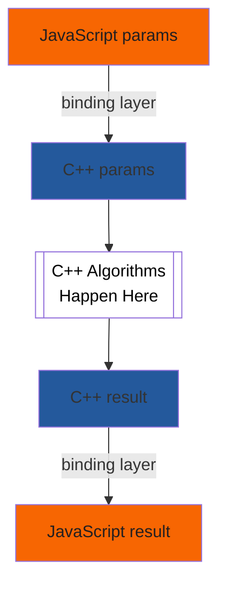

# Introduction to Writing Specifications with Bikeshed

- [Introduction to Writing Specifications with Bikeshed](#introduction-to-writing-specifications-with-bikeshed)
  - [Meta](#meta)
  - [Overview](#overview)
  - [Installing Bikeshed](#installing-bikeshed)
    - [Using GitHub](#using-github)
  - [Specification Structure](#specification-structure)
  - [Specification Languages](#specification-languages)
  - [Strategies for incremental development](#strategies-for-incremental-development)
  - [Initial setup](#initial-setup)
  - [Sample Full Specifications following Best Practices](#sample-full-specifications-following-best-practices)
  - [Spec writing overview](#spec-writing-overview)
    - [Explainer to Specification](#explainer-to-specification)
  - [Other Intros and Resources](#other-intros-and-resources)
    - [Not specific to Bikeshed](#not-specific-to-bikeshed)

## Meta

- This document: [Introduction to Writing Specifications with Bikeshed](https://dlaliberte.github.io/bikeshed-intro/index.html)
- Source: [bikeshed-intro/index.md at updates · dlaliberte/bikeshed-intro](http://go/gh/dlaliberte/bikeshed-intro/blob/updates/index.md)
- Issues: [Issues · dlaliberte/bikeshed-intro](http://go/gh/dlaliberte/bikeshed-intro/issues)

## Overview

This document is intended as a simple introduction to writing specifications of web APIs using Bikeshed.  Very extensive [Bikeshed Documentation](https://tabatkins.github.io/bikeshed/) is available, but it is a complex tool which is a challenge to get started using since there is a lot to learn before one can become productive.

As the Bikeshed documentation says: "Bikeshed is a spec-generating tool that takes in lightly-decorated Markdown and spits out a full spec, with cross-spec autolinking, automatic generation of indexes/ToC/etc, and many other features."

So the goal here is to help beginners get started using Bikeshed in the simplest way possible. And then we provide some guidance for starting to write the first few revisions of a specification.  We only cover the basics for many topics and refer to other documents for more complete details.  The following topics are covered here:

- [Installing Bikeshed](#installing-bikeshed)
- [Using GitHub](#using-github) for your specification repository
- [Strategies for incremental development](#strategies-for-incremental-development) of your specification


## Installing Bikeshed

The [Bikeshed Documentation: Installation](https://tabatkins.github.io/bikeshed/#installing) provides details on  several different ways for how to install and run Bikeshed.  We recommend you install it on a local machine so you can run it multiple times as you make changes to the specification.

- Make sure you have Python 3.7 or later.
- Install Bikeshed with pip3, if you can.
  - `pip3 install bikeshed`
  - `bikeshed update`
- Alternatively, you can use pip or pipenv, but see details at: [Bikeshed Documentation - Installing Bikeshed Itself](https://tabatkins.github.io/bikeshed/#install-final)
- You don't need to install "Bikeshed for Development", unless you are planning to do development on Bikeshed itself.


### Using GitHub

Assuming you will be using GitHub to develop and provide public access to your specification, you should first decide whether you will use an existing repo or create a new repo to serve as the "publishing source" repo for your specification. You need to be an admin for this source repo.

Then, it is convenient to set up a "GitHub Pages site" for publishing and serving the html file that will be generated by bikeshed from your source file.

- Create an initial "empty" specification file as your source, e.g. `spec.bs` or `index.bs`.
  - You can run `bikeshed template > index.bs` to generate a minimal template.
  - Or you can copy this [Minimal template](http://go/gh/WICG/starter-kit/blob/main/templates/index.bs).
- Follow instructions for [Publishing with a custom GitHub Actions workflow](https://docs.github.com/en/pages/getting-started-with-github-pages/creating-a-github-pages-site) down to selecting "GitHub Actions".
- Click "create your own" to start creating a `.github/workflows/*` file.
  - Name the file `build.yml`.
  - Use the following script, but change `spec.bs` to your spec file.
  - For more sample workflow actions, see [Spec Prod Documentation](https://w3c.github.io/spec-prod/)

```#yml
name: Build
on:
  pull_request: {}
  push:
    branches:
    - main
jobs:
  build:
    name: Build
    runs-on: ubuntu-latest
    steps:
    - uses: actions/checkout@v3
    - uses: w3c/spec-prod@v2
      with:
        TOOLCHAIN: bikeshed
        SOURCE: spec.bs
        DESTINATION: index.html
        GH_PAGES_BRANCH: gh-pages
        BUILD_FAIL_ON: warning
```

- Run Bikeshed on your spec with `bikeshed spec index.bs`

- Optional Configurations
  - Maybe turn on [GitHub Apps - PR Preview](https://github.com/apps/pr-preview).
  - Maybe use [GitHub Ribbons | The GitHub Blog](https://github.blog/2008-12-19-github-ribbons/)

## Specification Structure

The template generated above will have the following sections.
- Metadata
- Abstract
- Status of this document
- 1. Introduction
- Conformance
  - Document conventions
  - Conformant Algorithms
- References
  - Normative References

From Bard:

- Introduction: This section provides an overview of the document and its purpose.
- Definitions: This section defines any terms that are used in the document.
-Requirements: This section describes the requirements that must be met in order to comply with the standard.
- Conformance: This section describes how to determine if a product or service complies with the standard.
- Implementation: This section describes how to implement the standard.
- Examples: This section provides examples of how to implement the standard.
- Testing: This section describes how to test for compliance with the standard.
- Maintenance: This section describes how the standard will be maintained.
- Bibliography: This section lists any resources that were used in the creation of the document.

From ChatGPT:

- Web standard specification documents typically include the following sections:

- Introduction: This section provides an overview of the purpose and scope of the standard.

- Scope: This section outlines the scope of the standard and the specific areas it covers.

- Conformance: This section describes how to conform to the standard and specifies the requirements for conformance.

- Terminology: This section defines key terms and concepts used in the standard.

- Normative references: This section lists other standards and documents that are referenced in the standard and are necessary for its implementation.

- Overview: This section provides a high-level description of the s- Requirements: This section specifies the functional requirements of the standard.

- Design: This section describes the design of the standard, including its architecture, data structures, and algorithms.

- API: This section specifies the programming interface for implementing the standard.

- Examples: This section provides examples of how to use the standard.

- Security considerations: This section describes security issues related to the standard and provides guidance on how to mitigate them.

- Privacy considerations: This section describes privacy issues related to the standard and provides guidance on how to address them.

- Intellectual property considerations: This section describes any intellectual property rights associated with the standard and their implications for implementers.

- Acknowledgements: This section acknowledges individuals and organizations that contributed to the development of the standard.

- References: This section lists references to other documents that were consulted during the development of the standard.

From ChatGPT minimal outline:

- Introduction: This section provides background information on the standard, its purpose, and its intended audience.

- Scope: This section outlines the scope of the standard and the specific areas it covers.

- Normative References: This section lists the other standards and specifications that are referenced within the document and are required for implementation of the standard.

- Requirements: This section outlines the technical requirements that must be met for an implementation to be conformant.

- Security Considerations: This section discusses security considerations that should be taken into account when implementing the standard.

- References: This section lists other resources that may be helpful in implementing the standard.

Also:

- Abstract: The Abstract section provides a summary of the standard, including its purpose, scope, and key features. It's usually a short, standalone section that appears at the beginning of the document, before the Introduction.

- Glossary: The Glossary section provides definitions for key terms used throughout the document. This section can be particularly helpful for readers who are not familiar with the technical vocabulary associated with the standard. The Glossary is usually located near the beginning of the document, after the Introduction and before the main body of the document.

## Specification Languages




## Strategies for incremental development

If your API code already exists, and you have WebIDL specifications for that code, a great place to start is to copy in a subset of the WebIDL that corresponds to the public API.

After that, then you can add infra specs that reference the WebIDL specs.


If you have an implementation...

If you don't have an implementation...


Citing and linking.

Infra vs WebIDL

## Initial setup

[Domenic's guide to spec excellence - Docs](http://doc/1cRVD1k-hDBGfLVwTG14P_ZqJLM4d5-Z4vpwYFb_4qks#heading=h.qc07m2oa0jm)
(mostly tactical "how to start a new spec")


## Sample Full Specifications following Best Practices

* [Navigation API](https://wicg.github.io/navigation-api/)
* [Prioritized Task Scheduling](https://wicg.github.io/scheduling-apis/)
* [Close Watcher API](https://wicg.github.io/close-watcher/)


## Spec writing overview

### Explainer to Specification

[How to read, write, and think about specs - Slides](http://go/how-to-specs#slide=id.p)


## Other Intros and Resources

* A very helpful document, by Gary Kac, similar in purpose to this one:
[Writing Procedural Specs](https://garykac.github.io/procspec/)

* [Bikeshed Cheat Sheet by apowers313 - Download free from Cheatography - Cheatography.com: Cheat Sheets For Every Occasion](https://cheatography.com/apowers313/cheat-sheets/bikeshed/)

* [CSS Spec Preprocessor](https://api.csswg.org/bikeshed/)

* [Sample W3C Specification](https://w3c.github.io/tr-design/src/README)

### Not specific to Bikeshed

[Writing Promise-Using Specifications](https://www.w3.org/2001/tag/doc/promises-guide)

[Draft Spec - Read Write Web Community Group](https://www.w3.org/community/rww/wiki/Draft_Spec)

[QA Framework: Specification Guidelines](http://go/w3cstd/qaframe-spec/)

[Chromium Specification Mentors](http://go/chromium-spec-mentors)

[Home | Internet-Draft Author Resources](https://authors.ietf.org/)

[Web Platform Design Principles](https://w3ctag.github.io/design-principles/)
