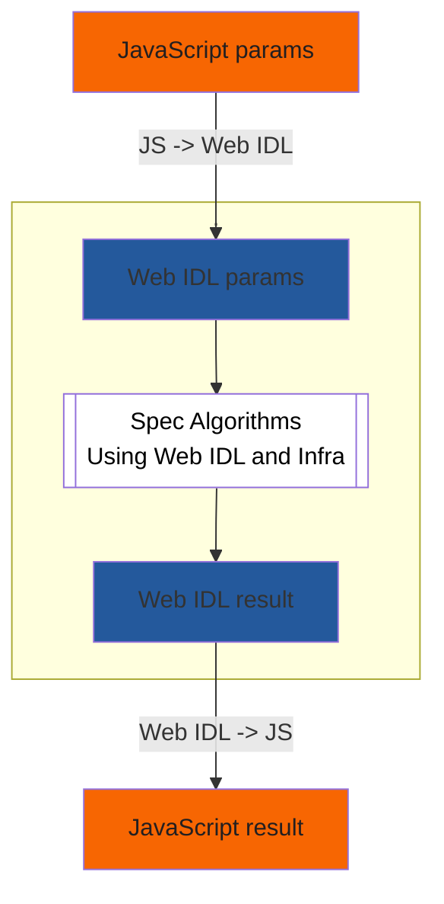

# Introduction to Writing Specifications with Bikeshed

- [Introduction to Writing Specifications with Bikeshed](#introduction-to-writing-specifications-with-bikeshed)
  - [Meta](#meta)
  - [Overview](#overview)
  - [Installing Bikeshed](#installing-bikeshed)
    - [Using GitHub](#using-github)
  - [Specification Document Structure](#specification-document-structure)
  - [Specification Languages](#specification-languages)
    - [Bikeshed Markdown to HTML](#bikeshed-markdown-to-html)
    - [JavaScript to Web IDL (with Infra) to JavaScript](#javascript-to-web-idl-with-infra-to-javascript)
  - [Strategies for incremental development](#strategies-for-incremental-development)
    - [Add WebIDL](#add-webidl)
    - [Describe WebIDL](#describe-webidl)
    - [Add Algorithms](#add-algorithms)
    - [Definitions and Linking](#definitions-and-linking)
- [References](#references)
  - [Initial setup](#initial-setup)
  - [Sample Full Specifications following Best Practices](#sample-full-specifications-following-best-practices)
  - [Other Intros and Resources](#other-intros-and-resources)
    - [Not specific to Bikeshed](#not-specific-to-bikeshed)
- [CSS for domintro](#css-for-domintro)

## Meta

- This document: [Introduction to Writing Specifications with Bikeshed](https://dlaliberte.github.io/bikeshed-intro/index.html)
- Source: [bikeshed-intro/index.md at updates · dlaliberte/bikeshed-intro](http://go/gh/dlaliberte/bikeshed-intro/blob/updates/index.md)
- Issues: [Issues · dlaliberte/bikeshed-intro](http://go/gh/dlaliberte/bikeshed-intro/issues)

## Overview

This document is intended as a simple introduction to writing specifications of web APIs using Bikeshed.  Very extensive [Bikeshed Documentation](https://tabatkins.github.io/bikeshed/) is available, but it is a complex tool which is a challenge to get started using since there is a lot to learn before one can become productive.

As the Bikeshed documentation says: "Bikeshed is a spec-generating tool that takes in lightly-decorated Markdown and spits out a full spec, with cross-spec autolinking, automatic generation of indexes/ToC/etc, and many other features."

So the goal here is to help beginners get started using Bikeshed in the simplest way possible. And then we provide some guidance for starting to write the first few revisions of a specification.  We only cover the basics for many topics and refer to other documents for more complete details.  The following topics are covered here:

- [Installing Bikeshed](#installing-bikeshed)
- [Using GitHub](#using-github) for your specification repository
- [Strategies for incremental development](#strategies-for-incremental-development) of your specification


## Installing Bikeshed

The [Bikeshed Documentation: Installation](https://tabatkins.github.io/bikeshed/#installing) provides details on  several different ways for how to install and run Bikeshed.  We recommend you install it on a local machine so you can run it multiple times as you make changes to the specification.

- Make sure you have Python 3.7 or later.
- Install Bikeshed with pip3, if you can.
  - `pip3 install bikeshed`
  - `bikeshed update`
- Alternatively, you can use pip or pipenv, but see details at: [Bikeshed Documentation - Installing Bikeshed Itself](https://tabatkins.github.io/bikeshed/#install-final)
- You don't need to install "Bikeshed for Development", unless you are planning to do development on Bikeshed itself.


### Using GitHub

Assuming you will be using GitHub to develop and provide public access to your specification, you should first decide whether you will use an existing repo or create a new repo to serve as the "publishing source" repo for your specification. You need to be an admin for this source repo.

Then, it is convenient to set up a "GitHub Pages site" for publishing and serving the html file that will be generated by bikeshed from your source file.

- Create an initial "empty" specification file as your source, e.g. `spec.bs` or `index.bs`.
  - You can run `bikeshed template > spec.bs` to generate a minimal template.
  - Or you can copy this [Minimal template](http://go/gh/WICG/starter-kit/blob/main/templates/index.bs).
- Follow instructions for [Publishing with a custom GitHub Actions workflow](https://docs.github.com/en/pages/getting-started-with-github-pages/creating-a-github-pages-site).  I.e. go to Settings > Pages to show "GitHub Pages"
- Under Build and deployment, Source, select "GitHub Actions" if not already selected.
- Click the "<span style="color:lightblue">create your own</span>" link to start creating a yml script.
  - Enter the name of the file (after `.github/workflows/`) to `build.yml` or `spec.yml`.
  - Use the following script, but change `spec.bs` and `spec.html` to use your spec file.
    - For more sample workflow actions, see [Spec Prod Documentation](https://w3c.github.io/spec-prod/)

```yml
name: Build
on:
  pull_request: {}
  push:
    branches:
    - main
jobs:
  build:
    name: Build
    runs-on: ubuntu-latest
    steps:
    - uses: actions/checkout@v3
    - uses: w3c/spec-prod@v2
      with:
        TOOLCHAIN: bikeshed
        SOURCE: spec.bs
        DESTINATION: spec.html
        GH_PAGES_BRANCH: gh-pages
        BUILD_FAIL_ON: warning
```
- Change permissions to allow `github-actions[bot]` under Settings > Actions > General > Workflow permissions.  The default is "Read repository contents and packages permission", so change that to: "Read and write permissions".  Remember to click "Save".

- Run Bikeshed on your spec with `bikeshed spec spec.bs` to generate
  `spec.html`.
- Submit your change to GitHub, which should then trigger the action that updates spec.html.
- If your repo is `github.com/owner/repo-name`, then your html file will be at `owner.github.io/repo-name/spec.html`.

- Optional Configurations
  - Maybe turn on [GitHub Apps - PR Preview](https://github.com/apps/pr-preview).
  - Maybe use [GitHub Ribbons | The GitHub Blog](https://github.blog/2008-12-19-github-ribbons/)

## Specification Document Structure


The `spec.bs` template generated above will contain only a metadata section
and an Introduction, but when you run `bikeshed spec spec.html`, the
`spec.html` file will include the following sections.

- Metadata

- Abstract

- Status of this document

- **Introduction**: This section provides an overview of the purpose and scope of the standard.

- **API Sections**: These sections specify the programming interface for implementing the standard.

- **Definitions**: This section defines key terms and concepts used in the standard.

- **Security considerations**: This section describes security issues related to the standard and provides guidance on how to mitigate them.

- **Privacy considerations**: This section describes privacy issues related to the standard and provides guidance on how to address them.

- **Conformance**: This section describes how to conform to the standard and specifies the requirements for conformance.

- **Normative References**: This section lists the other standards and specifications that are referenced within the document and are required for implementation of the standard.


## Specification Languages

### Bikeshed Markdown to HTML

Bikeshed uses a Markdown variant called [Bikeshed-flavored Markdown (BSMD)](https://speced.github.io/bikeshed/#markdown).  By default, it recognizes all of the "block-level" Markdown constructs defined by [CommonMark](https://commonmark.org/), except for indented code blocks.  You can freely switch back and forth between Markdown and HTML as needed, and indent properly.

### JavaScript to Web IDL (with Infra) to JavaScript

<table style="border:0">
<tr>
<td style="border:0">



</td>
<td style="border: 0; align:top">
 JS types: <br/>
 boolean, number, array, object, ...
 <br/><br/><br/>
 Web IDL types:<br/>
 boolean, unsigned long, sequence, dictionary, ...
  <br/><br/><br/>
 Infra types: ...
  <br/><br/><br/><br/> <br/><br/><br/><br/><br/><br/>
</td>
</tr>
</table>


## Strategies for incremental development

Once you have created an empty a spec document, it might be easiest to
follow the following steps to incrementally enhance your spec.
### Add WebIDL

If you have WebIDL specifications for your API code, that is a great place to start.  Simply copy-paste a subset of the WebIDL that corresponds to the public API into an `<xmp class="idl">` tag.  Bikeshed docs recommend using the `<xmp>` tag rather than the `<pre>` tag so that you will not need to HTML-escape `&` and `<` characters.

```html
<xmp class="idl">
  ...your WebIDL here...
</xmp>
```

### Describe WebIDL

Immediately before or after each WebIDL block, it is important to include a short, non-normative description, or **`"domintro"`** for each property defined. These descriptive blocks are especially important for algorithmic specifications which are otherwise difficult to read.

The suggested markup for a domintro block is as follows:

```html
<dl class="domintro">
  <dt><code>property</code>
  <dd>
    <p>Brief summary of property
</dl>
```

<!-- can't show the rendering yet.
Which will be rendered like this (using the CSS included below):

<blockquote>
<dl class="domintro">
  <dt><code>property</code>
  <dd>
    <p>Brief summary of property
</dl>
</blockquote>
-->

### Add Algorithms

Once you have some WebIDL declarations of functions and types of parameters, then you can define an **algorithm** for each function in terms of Web IDL along with Infra declarations for internal data structures. Use a `<div class="algorithm">` container for your algorithm steps, so Bikeshed can add nice default styling to make the algorithms easier to read.

```html
<div class="algorithm" data-algorithm="my-algorithm">
  ...your algorithm steps here...
</div>
```


### Definitions and Linking

Defining a term is as easy as wrapping a `<dfn>` element around it. Most of the time, this is all you'll need to do.  Bikeshed can then automatically link from each use of a defined term to its definition.


# References
## Initial setup

[Domenic's guide to spec excellence - Docs](http://doc/1cRVD1k-hDBGfLVwTG14P_ZqJLM4d5-Z4vpwYFb_4qks#heading=h.qc07m2oa0jm)
(mostly tactical "how to start a new spec")


## Sample Full Specifications following Best Practices

* [Navigation API](https://wicg.github.io/navigation-api/)
* [Prioritized Task Scheduling](https://wicg.github.io/scheduling-apis/)
* [Close Watcher API](https://wicg.github.io/close-watcher/)


## Other Intros and Resources


* Slides: [How to read, write, and think about specs](http://go/how-to-specs#slide=id.p) and video: [Writing good specs](http://dr/file/d/0BwPS_JpKyELWX25uZUtfR1JrQ1U/view?resourcekey=0-W45El7Ho8QRHdwb3TAKnMA)

* A very helpful document, by Gary Kac, similar in purpose to this one:
[Writing Procedural Specs](https://garykac.github.io/procspec/)

* [Bikeshed Cheat Sheet by apowers313 - Download free from Cheatography - Cheatography.com: Cheat Sheets For Every Occasion](https://cheatography.com/apowers313/cheat-sheets/bikeshed/)

* [CSS Spec Preprocessor](https://api.csswg.org/bikeshed/)

* [Sample W3C Specification](https://w3c.github.io/tr-design/src/README) and

### Not specific to Bikeshed

* [Writing Promise-Using Specifications](https://www.w3.org/2001/tag/doc/promises-guide)

* [Draft Spec - Read Write Web Community Group](https://www.w3.org/community/rww/wiki/Draft_Spec)

* [QA Framework: Specification Guidelines](http://go/w3cstd/qaframe-spec/)

* [Chromium Specification Mentors](http://go/chromium-spec-mentors)

* [Home | Internet-Draft Author Resources](https://authors.ietf.org/)

* [Web Platform Design Principles](https://w3ctag.github.io/design-principles/)


# CSS for domintro

```css
<style>
/* domintro from https://resources.whatwg.org/standard.css */
dl.domintro {
  position: relative;
  color: green;
  background: #DDFFDD;
  margin: 2.5em 0 2em 0;
  padding: 1.5em 1em 0.5em 2em;
}
dl.domintro dt, dl.domintro dt * {
  color: black;
  font-size: inherit;
}
dl.domintro dd {
  margin: 0.5em 0 1em 2em; padding: 0;
}
dl.domintro dd p {
  margin: 0.5em 0;
}
dl.domintro::before {
  content: 'For web developers (non-normative)';
  background: green;
  color: white;
  padding: 0.15em 0.25em;
  font-style: normal;
  position: absolute;
  top: -0.8em;
  left: -0.8em;
}
</style>
```

<!-- can't include style yet in github markdown
<style>
...
</style>
-->
